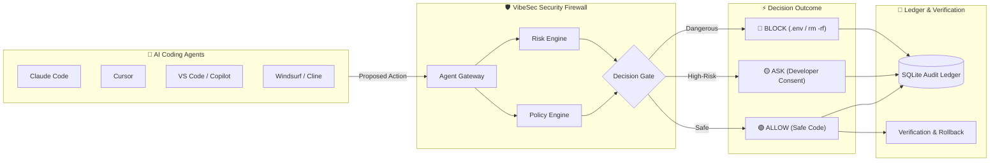

# VibeSec 🛡️

> **The Security & Control Firewall for AI Coding Agents** (Claude Code, Cursor, Codex)

VibeSec is a local-first security layer that sits between your AI coding assistant and your computer. It ensures your AI agent can read and write code safely without leaking secrets, deleting files, or pushing unauthorized changes.

---

## 💡 Visual System Architecture



---

## 💡 What VibeSec Does in 3 Simple Steps

```
[ AI Agent ] ──> [ VibeSec Firewall ] ──> [ Your Computer ]
                        │
             ┌──────────┼──────────┐
             ▼          ▼          ▼
          ALLOW        ASK       BLOCK
       (Safe code)  (Confirm)  (.env/rm -rf)
```

1. **Observe**: Intercepts every file read, file write, or terminal command proposed by an AI agent.
2. **Control**: Evaluates actions against local security policies and risk algorithms.
3. **Verify**: Runs tests and builds automatically to make sure AI-generated fixes actually work.

---

## 🚀 Quick Start Guide

### 1. Installation
```bash
# Clone and build
git clone https://github.com/your-repo/vibesec.git
cd vibesec
npm install
npm run build
npm link
```

### 2. Protect Any Project
Navigate to your project directory and initialize VibeSec:
```bash
cd /path/to/my-project
vibesec init
```

### 3. Run Commands Through the Firewall
```bash
# Safe dev command -> ALLOWED
vibesec exec "node -v"

# Reading .env or credentials -> BLOCKED AUTOMATICALLY
vibesec exec -r .env

# Destructive commands -> BLOCKED AUTOMATICALLY
vibesec exec "rm -rf /"

# High-risk actions -> PROMPTS YOU FOR YES/NO APPROVAL
vibesec exec "git push origin main --force"
```

### 4. View Audit Logs
```bash
# View all intercepted actions and blocked attempts
vibesec logs
```

---

## 🛠️ Essential CLI Commands

| Command | What It Does |
| :--- | :--- |
| `vibesec init` | Initialize VibeSec protection in current directory |
| `vibesec exec "<command>"` | Run a command through policy checks |
| `vibesec status` | Check active protection rules and event counts |
| `vibesec policy` | View configured security policy rules |
| `vibesec logs` | Show event audit log (secrets automatically masked) |
| `vibesec verify` | Run test & build verification suite |
| `vibesec rollback` | Restore project state to safe Git checkpoint |

---

## 🔒 Security Principles

* **Zero-Trust LLM**: AI agents are never allowed to approve their own actions or certify code safety.
* **Deterministic Rules**: Policy evaluation uses exact local glob and AST shell parsing.
* **Secret Masking**: Passwords, API keys (`AKIA...`, `sk-...`), and `.env` credentials are scrubbed before writing to logs.
* **Local-First**: Everything runs on your machine — zero network overhead or external servers required.
